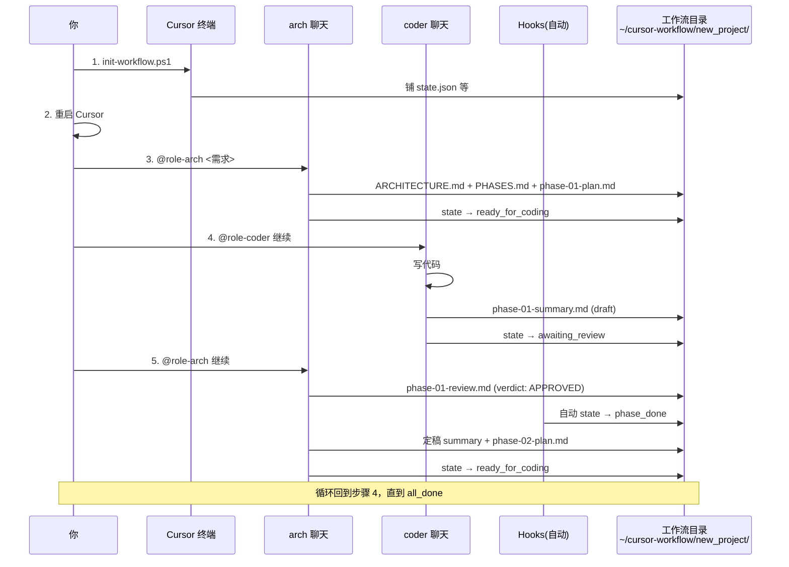

# 新项目开工操作手册

假设你的新项目叫 `new_project`，完整路径是 `C:\xxx\new_project\`，Cursor 已经以这个目录为工作区打开。下面是从零到第一阶段完成的完整操作。

## 时序总览



## Step 1：一次性初始化（30 秒）

Cursor 打开 `C:\xxx\new_project\` 后，按 `` Ctrl+` `` 开终端，粘贴：

```powershell
powershell -NoProfile -ExecutionPolicy Bypass -File $HOME\.cursor\init-workflow.ps1
```

会看到类似输出：

```
=== 双 Agent 工作流初始化 ===
Workspace    : C:\xxx\new_project
ProjectName  : new_project

[1/3] 安装项目级规则到 .cursor/rules/
  wrote          : ...\.cursor\rules\role-arch.mdc
  wrote          : ...\.cursor\rules\role-coder.mdc
  wrote          : ...\.cursor\rules\workflow-core.mdc

[2/3] 初始化工作流目录
  mode           : user-global (C:\Users\Administrator\cursor-workflow\new_project)

[3/3] 铺设工作流基础文件
  wrote          : ...\new_project\state.json
  ...
```

这一步做了两件事：

- 把 `workflow-core`、`role-arch`、`role-coder` 三个规则**复制**到 `C:\xxx\new_project\.cursor\rules\`（Cursor 规则必须项目级）
- 在 `~\cursor-workflow\new_project\` 下创建状态文件和文档模板

## Step 2：重启 Cursor（15 秒）

关掉当前 Cursor 窗口，重新打开 `C:\xxx\new_project\`。

原因：Cursor 只在工作区启动时扫描 `.cursor/rules/`，新增规则文件需要重启才识别。`~/.cursor/hooks.json` 也同理——不过这个你首次装框架时已经重启过一次，以后就不用再重启了。

## Step 3：arch 聊天——出架构设计（5-15 分钟）

`Ctrl+L` 开聊天，输入：

```
@role-arch

新需求：<这里写需求>

例如：给 MLX81339B 的温度传感器加一路软件校准通道，支持两点校准（低温点 / 高温点），校准参数掉电保存。
```

聊天上方会提示 sessionStart hook 注入的上下文（状态机当前在 `arch_design`）。arch 会：

1. 读 `~/cursor-workflow/new_project/state.json`
2. 浏览项目代码（`code/`、`verification/` 等）做影响面分析
3. 产出三个文档：
   - `~/cursor-workflow/new_project/ARCHITECTURE.md`
   - `~/cursor-workflow/new_project/PHASES.md`
   - `~/cursor-workflow/new_project/phase-01-plan.md`
4. 把 `state.status` 改为 `ready_for_coding`

**你的动作**：读一遍 `PHASES.md` 和 `phase-01-plan.md`，不满意就在同一聊天里追问/调整；满意了就直接下一步。

## Step 4：coder 聊天——写代码（时间看阶段大小）

**`Ctrl+N` 开一个新聊天**（重要：新聊天，这样 coder 的上下文和 arch 隔离干净），输入：

```
@role-coder 继续
```

sessionStart hook 会把当前状态 `ready_for_coding, phase=01` 注入上下文。coder 会：

1. 读 `phase-01-plan.md`、`ARCHITECTURE.md` 相关章节
2. 把 `state.status` 改为 `coding`
3. 按 plan 逐文件实现
4. 完成节点后运行 `make`，起草 `~/cursor-workflow/new_project/phase-01-summary.md`（frontmatter `status: draft`）
5. 把 `state.status` 改为 `awaiting_review`

如果 coder 停下之前忘了写 summary，**stop hook** 会自动给它一个 followup，提示"该写 summary 了"。

**你的动作**：瞄一眼 coder 写的代码和 summary，基本不用管，等它自己把 state 改到 `awaiting_review`。

## Step 5：arch 聊天——code review（5-10 分钟）

**切回第一个 arch 聊天**（不是开新的），输入：

```
@role-arch 继续
```

sessionStart hook 会注入新状态 `awaiting_review, phase=01`。arch 会：

1. 读 `phase-01-summary.md` 里 coder 记录的 DEVIATION 和"待决策问题"
2. `git diff` 看代码改动
3. 逐条核对 `phase-01-plan.md` 的 DoD
4. 写 `~/cursor-workflow/new_project/phase-01-review.md`，frontmatter 里必有 `verdict: APPROVED` 或 `verdict: REJECTED`

**当 arch 保存这个 review.md 文件时**，afterFileEdit hook **自动**：

- 如果 APPROVED → `state.status = phase_done`
- 如果 REJECTED → `state.status = rework`，同时把 `- [ ]` 整改项抽进 `state.rework_items`

## Step 6 岔路：APPROVED 继续 / REJECTED 返工

### 情况 A：APPROVED

arch 当前聊天继续：会被 stop hook 提示"去定稿 summary 并写下阶段 plan"。让它一气呵成：

- 把 `phase-01-summary.md` 的 frontmatter 从 `status: draft` 改成 `status: finalized`，补全"Review 结论"段
- 写 `phase-02-plan.md`
- 把 `state.status` 改回 `ready_for_coding`、`current_phase = 2`

回到 **Step 4**，coder 聊天继续写 phase 02。

### 情况 B：REJECTED

切到 coder 聊天（不用开新的，还是原来那个），输入：

```
@role-coder 继续
```

sessionStart 注入的状态是 `rework`，coder 会自动读 `state.rework_items` + `phase-01-review.md` 的整改项，逐条修代码、更新 summary draft，最后把 state 改回 `awaiting_review`。

然后回到 **Step 5**（arch 再 review 一次）。

## Step 7：顺手备份（可选但推荐，10 秒）

一个阶段告一段落，开个终端：

```powershell
cd $HOME\cursor-workflow
git add . && git commit -m "new_project: phase 01 APPROVED" && git push
```

这样换电脑时整个设计和 review 历史都在远端。

## 循环终局

当最后一个阶段 APPROVED 后，arch 会把 `state.status` 改成 `all_done`。整个项目的架构档案、阶段分解、每次 review 结论、最终 summary 全都沉淀在 `~/cursor-workflow/new_project/`，随时可以回溯。

---

## 速查卡（贴桌面上那种）

| 场景 | 动作 |
|--|--|
| 新项目第一次用 | `init-workflow.ps1` → 重启 Cursor |
| 开工或下阶段开始 | arch 聊天输入 `@role-arch 继续`（首次为 `@role-arch <需求>`） |
| 架构就绪、写代码 | coder 聊天输入 `@role-coder 继续` |
| 代码完成、要 review | 切回 arch 聊天 `@role-arch 继续` |
| review 不通过 | 切回 coder 聊天 `@role-coder 继续`（自动看整改项） |
| 想知道现在状态 | 看 `~/cursor-workflow/<项目名>/state.json` 的 `status` |
| 想强制跳转 | 手改 `state.json`，下次 sessionStart 就按新状态走 |
| 一阶段结束想留痕 | `cd $HOME\cursor-workflow; git add . && git commit -m "..." && git push` |

## 关于"两个聊天"的心智

- **arch 聊天从头到尾只用一个**：它是设计+review 的连续账本，上下文累积反而是好事（越到后期它越熟悉项目）
- **coder 聊天也基本从头到尾只用一个**：但如果 phase 之间跨度很大或上下文太长，可以新开一个——反正 sessionStart hook 会把 state 注入，新聊天开局就知道自己在做什么
- **千万别混用**：别在 arch 聊天里让它写代码，也别在 coder 聊天里让它做 review。角色规则已经在 `workflow-core.mdc` 里硬约束了，越权它会自己停下，但别故意去挑战它
